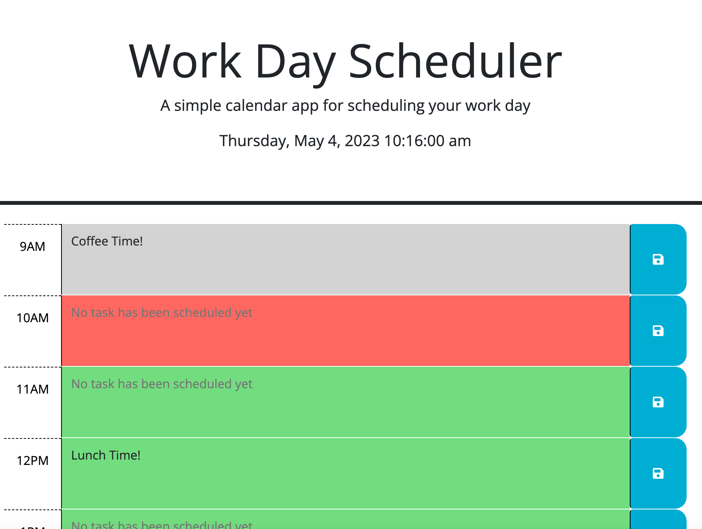

# Week5-Schedule-Input

Create a simple calendar application that allows a user to save events for each hour of the day by modifying starter code. This app will run in the browser and feature dynamically updated HTML and CSS powered by jQuery.

You'll need to use the [Day.js](https://day.js.org/en/) library to work with date and time. Be sure to read the documentation carefully and concentrate on using Day.js in the browser.

## User Story

```md
AS AN employee with a busy schedule
I WANT to add important events to a daily planner
SO THAT I can manage my time effectively
```

## Acceptance Criteria

```md
GIVEN I am using a daily planner to create a schedule
WHEN I open the planner
THEN the current day is displayed at the top of the calendar
WHEN I scroll down
THEN I am presented with timeblocks for standard business hours
WHEN I view the timeblocks for that day
THEN each timeblock is color coded to indicate whether it is in the past, present, or future
WHEN I click into a timeblock
THEN I can enter an event
WHEN I click the save button for that timeblock
THEN the text for that event is saved in local storage
WHEN I refresh the page
THEN the saved events persist
```

## Technologies Used

This application is built using the following technologies:

- **HTML5**: Markup language for structuring content.
- **CSS**: Stylesheet language for styling HTML content.
- **JavaScript**: Programming language for adding interactivity and dynamic content.
- **Bootstrap**: Front-end framework for developing responsive and mobile-first websites.
- **jQuery**: JavaScript library for DOM manipulation and event handling.


## Usage

open index.html in Google Chrome (recommended), the Schedule Input is shown as below:


the current time is updated every second. 



The Task input textareas are color-coded, with grey for past events, red for present event and green for future events


on clicking the save button after input the task, a message is displayed out.


On Refresh the page, start page is shown with saved entries


## Features

it includes the following features:

1.  The current date, day and time are displayed on start page.
2.  The current time will be updated on every second.
3.  Task input text areas are color-coded, with grey for past events, red for present event and gree for future events
4.  The text areas color-coded is updated per minute
5.  On clicking the save button after inputting a task, it will save to localStorage
6.  upon saved to localStorage, a message is displayed out to show the task is saved and the message will fade out in 3 second.
7.  On refreshing the page, the saved entries still can be shown


## Tests

Testing done on:

1. testing on current day, date, time display.
2. testing time update on every second
3. testing input text areas color-coded.
4. testing on text areas update on every minute (to test by watching carefully on every 59min per hour and see if any updating on next hour)
5. testing on input a task and saved, entry is saved in localStoreage.
6. testing on display saved message after entry saved in localStorage.
7. testing on refreshing the page, saved entries still can be retrieved from localStorage.
8. testing on save button on blank input in textArea, nothing saved to localStorage and no saved message shown.
9. testing on updating the existing saved entries, entry is updated to localStorage.
10. testing on update entry retrieveal on refreshing the page


## Resources

Link to Deployed Website:
https://percivalho.github.io/Week4-Coding-Quiz-Challenge/

Link to GitHub repo:
https://github.com/percivalho/Week4-Coding-Quiz-Challenge.git


## License 


## Credits and Copyright 
&copy; Copyright 2023 - Present. Percival Ho